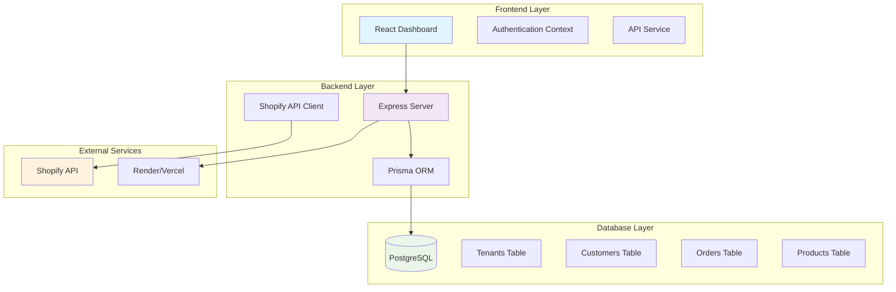

# Xeno Dashboard

## Overview

Enterprise-grade multi-tenant dashboard for Shopify store analytics with real-time data synchronization, customer segmentation, and business intelligence.

**Key Features:**
- Multi-tenant architecture for unlimited stores
- Real-time Shopify API integration
- Advanced customer analytics (RFM analysis)
- Modern React frontend with Tailwind CSS
- Scalable Node.js backend with Prisma ORM

---

## Setup Instructions

### Prerequisites
- Node.js 18+ 
- PostgreSQL database (or Neon account)
- Shopify store with Admin API access
- Git

### Backend Setup
1. Navigate to `xeno-backend` directory
2. Install dependencies with `npm install`
3. Copy `env.example` to `.env`
4. Configure environment variables:
   - `DATABASE_URL` - PostgreSQL connection string
   - `FASHION_STORE_ACCESS_TOKEN` - Shopify access token
   - `BOOKS_STORE_ACCESS_TOKEN` - Shopify access token
   - `ELECTRONICS_STORE_ACCESS_TOKEN` - Shopify access token
5. Generate Prisma client with `npm run build`
6. Start development server with `npm start`

### Frontend Setup
1. Navigate to `xeno-dashboard` directory
2. Install dependencies with `npm install`
3. Create `.env.local` file
4. Set `REACT_APP_API_URL=http://localhost:4000`
5. Start development server with `npm start`

### Database Setup
1. Run Prisma migrations with `npx prisma migrate dev`
2. Optionally seed initial data with sync commands

---

## Architecture Diagram



### Technology Stack

**Frontend:**
- React 18.3.1 - Component-based UI framework
- Tailwind CSS 3.3.0 - Utility-first styling
- React Router 6.8.0 - Client-side routing
- Recharts 2.8.0 - Data visualization
- Axios 1.6.0 - HTTP client

**Backend:**
- Node.js 22.16.0 - Runtime environment
- Express 5.1.0 - Web application framework
- Prisma 6.15.0 - Database ORM
- PostgreSQL - Primary database
- Shopify Admin API - External data source

**Deployment:**
- Render - Backend hosting platform
- Vercel - Frontend hosting platform
- Neon - Database hosting service

---

## API Endpoints

### Authentication
- `POST /api/auth/login` - User authentication
- `GET /api/auth/me` - Get current user

### Store Management
- `GET /api/stores` - List all stores
- `GET /api/tenants` - List all tenants

### Data Synchronization
- `POST /api/sync/customers` - Sync customers from Shopify
- `POST /api/sync/orders` - Sync orders from Shopify
- `POST /api/sync/products` - Sync products from Shopify
- `POST /api/sync/all` - Sync all data

### Analytics & Metrics
- `GET /api/metrics?tenantId={id}` - Get store metrics
- `GET /metrics/trends?tenantId={id}` - Get trend data
- `GET /api/top-customers?tenantId={id}` - Get top customers

### System
- `GET /health` - Health check endpoint

### Example API Usage

```javascript
// Get metrics for a store
const response = await fetch('/api/metrics?tenantId=fashion-store');
const metrics = await response.json();

// Sync all data for a store
const syncResponse = await fetch('/api/sync/all', {
  method: 'POST',
  headers: { 'Content-Type': 'application/json' },
  body: JSON.stringify({ tenantId: 'fashion-store' })
});
```

---

## Database Schema

### Core Tables

#### Tenants
```sql
model Tenant {
  id            String   @id
  name          String
  shopifyDomain String
  accessToken   String
  apiVersion    String   @default("2023-10")
  createdAt     DateTime @default(now())
  updatedAt     DateTime @updatedAt
  
  customers Customer[]
  orders    Order[]
  products  Product[]
}
```

#### Customers
```sql
model Customer {
  id          String   @id @default(cuid())
  tenantId    String
  shopifyId   String
  email       String?
  firstName   String?
  lastName    String?
  phone       String?
  totalSpent  Float    @default(0)
  ordersCount Int      @default(0)
  createdAt   DateTime @default(now())
  updatedAt   DateTime @updatedAt
  
  tenant Tenant @relation(fields: [tenantId], references: [id])
  orders Order[]
  
  @@unique([tenantId, shopifyId])
}
```

#### Orders
```sql
model Order {
  id          String   @id @default(cuid())
  tenantId    String
  shopifyId   String
  customerId  String?
  orderNumber String
  totalPrice  Float
  currency    String   @default("USD")
  status      String   @default("pending")
  createdAt   DateTime @default(now())
  updatedAt   DateTime @updatedAt
  
  tenant   Tenant    @relation(fields: [tenantId], references: [id])
  customer Customer? @relation(fields: [customerId], references: [id])
  items    OrderItem[]
  
  @@unique([tenantId, shopifyId])
}
```

#### Products
```sql
model Product {
  id          String   @id @default(cuid())
  tenantId    String
  shopifyId   String
  title       String
  handle      String?
  vendor      String?
  productType String?
  status      String   @default("active")
  createdAt   DateTime @default(now())
  updatedAt   DateTime @updatedAt
  
  tenant Tenant     @relation(fields: [tenantId], references: [id])
  items  OrderItem[]
  
  @@unique([tenantId, shopifyId])
}
```

### Relationships
- **Tenant** → **Customers** (1:many)
- **Tenant** → **Orders** (1:many)
- **Tenant** → **Products** (1:many)
- **Customer** → **Orders** (1:many)
- **Order** → **OrderItems** (1:many)
- **Product** → **OrderItems** (1:many)

---

## Known Limitations & Assumptions

### Current Limitations

1. **Authentication**: Uses mock authentication (admin@xeno.com / admin123)
2. **Rate Limiting**: No Shopify API rate limiting implemented
3. **Error Handling**: Basic error handling for API failures
4. **Data Validation**: Limited input validation on API endpoints
5. **Caching**: No caching layer for frequently accessed data
6. **Webhooks**: No real-time webhook integration
7. **Multi-language**: English only
8. **Mobile**: Not optimized for mobile devices

### Assumptions

1. **Shopify API Access**: All stores have Admin API access with appropriate permissions
2. **Data Volume**: Designed for small to medium-sized stores (< 10,000 customers)
3. **Network**: Stable internet connection for API synchronization
4. **Browser Support**: Modern browsers with ES6+ support
5. **Database**: PostgreSQL with sufficient storage and performance

### Performance Considerations

1. **Sync Frequency**: Manual sync only (no automatic scheduling)
2. **Data Retention**: No automatic data cleanup policies
3. **Concurrent Users**: Designed for single-user or small team usage
4. **API Limits**: Shopify API limits may affect large data syncs

---

## License

This project is licensed under the MIT License - see the [LICENSE](LICENSE) file for details.

---

**Built with ❤️ for Shopify store owners and developers**
